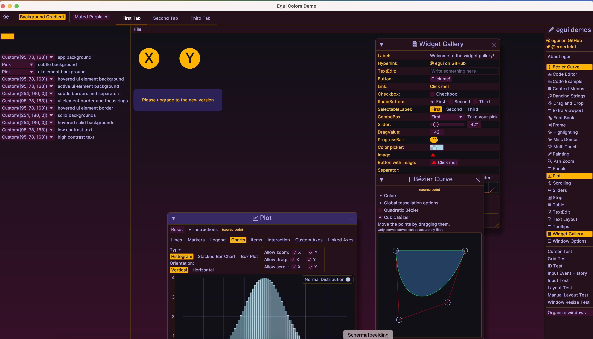

# egui_colors

Experimental toolkit to explore color styling in [`egui`](https://github.com/emilk/egui)

Based on the [`Radix`](https://www.radix-ui.com/colors/docs/palette-composition/understanding-the-scale) 
system, which defines 12 functional UI elements, and maps them to a color scale. 

Scales (both light and dark mode) are computed and based on luminosity contrast algorithm defined by [`APCA`](https://github.com/Myndex). Every scale uses one predefined [u8; 3] rgb color that is used as an accent color (if suitable).




## General Remarks

Although it is perfectly possible to use egui_colors to style your egui app, it's intended use is to explore the styling landscape and see
where Egui's and users needs lie. It is also possible to extend the basis to other GUI libraries such as `Xilem` or `MakePad` if there is interest.

Some questions to be answered. Is the Radix system suitable for Egui? Are the 12 functional components enough? Does it need 2 or more colorix scales? Is the implementation of the Apca algorithm sufficient?

Several observations I made: 

1) The default egui font seems not entirely suited (too thin) for the radix system. The example uses the Rerun one: 'inter_medium'.

2) One scale doesn't seem sufficient for styling an entire app. For instance, I didn't touch the `error` or `warn` colors. Neither any `alpha` components (such as shadows).


## Usage


Basic setting of theme.

```rust
use egui_color::{Colorix; ColorPreset};

// Define a colorix field in your egui App
#[derive(Default)]
struct App {
    colorix: Colorix,
    ...
}
// Choose a light or dark theme.
// initialize the Colorix with a theme
// a color theme is defined as [ColorPreset; 12]
// a ColorPreset is an enum with several preset colors and one Custom.
impl App {
    fn new(ctx: &egui::Context) -> Self {
        ctx.set_theme(egui::Theme::Dark);
        let yellow_theme = [ColorPreset::Custom([232, 210, 7]); 12]
        let colorix = Colorix::init(ctx, yellow_theme);
        Self {
            colorix,
            ..Default::default()
        }
    }
}
```

Several utility tools are available.
```rust
// use the provided function 'light_dark_toggle_button' for switching between light and dark mode. If you use one from egui, it will revert to the egui theme.
app.colorix.light_dark_toggle_button(ctx, ui);

// dropdown with the 12 ColorTokens and a color picker for a custom color. NOTE: the color picker is clamped to suitable ranges. If the selected color's contrast is not sufficient, it will be replaced by a more saturated version.
app.colorix.custom_picker(ui);
app.colorix.ui_combo_12(ctx, ui);

// dropdown with themes. It is possible to add custom themes to the list with an Option<(Vec<&str>, Vec<[ColorPreset; 12]>)>
let names = vec!["YellowGreen"];
let themes = vec![[ColorPreset::Custom([178, 194, 31]); 12]];
let custom = Some((names, themes));

// if you want to display custom themes only, set bool to `true`
app.colorix.themes_dropdown(ctx, ui, custom, false);

// Possibility to use a background gradient. 
app.colorix.draw_background(ctx, false);

```

## Examples
See the example `hello_colors`.

Another [`example`](https://github.com/crumblingstatue/mpv-egui-musicplayer/commit/2e77b7f7c729f7fd55e652f78826e1f417ad3eaa) from an experienced user how to set up Egui Colors.