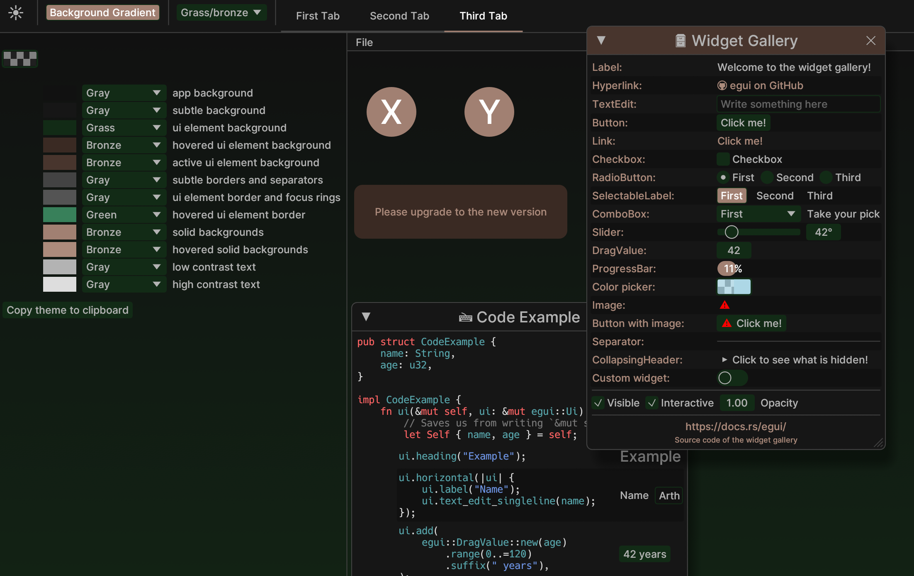
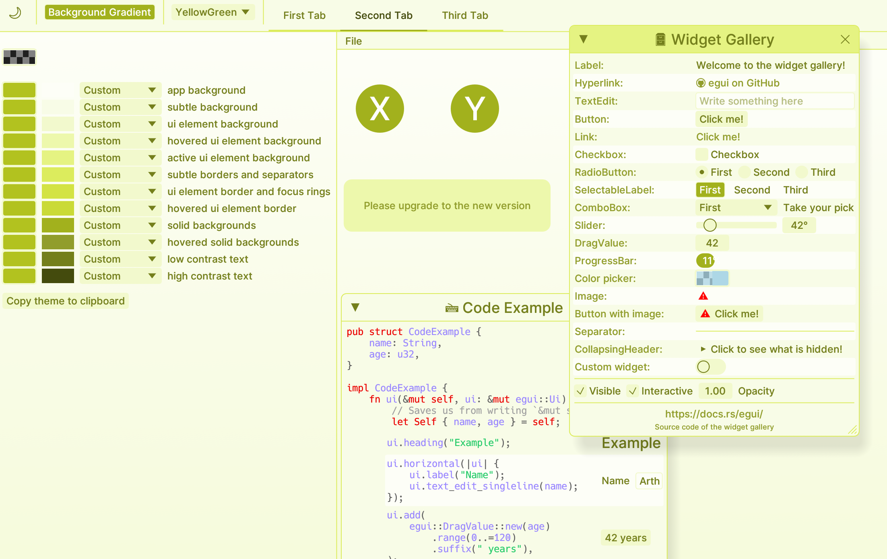

# egui_colors

Experimental toolkit to explore color styling in [`egui`](https://github.com/emilk/egui)

Based on the [`Radix`](https://www.radix-ui.com/colors/docs/palette-composition/understanding-the-scale) 
system, which defines 12 functional UI elements, and maps them to a color scale. 

Scales (both light and dark mode) are computed and based on luminosity contrast algorithm defined by [`APCA`](https://github.com/Myndex). Every scale uses one predefined [u8; 3] rgb color that is used as an accent color (if suitable). Colors are manipulated in Linear Srgb and [OkHsl](https://bottosson.github.io/posts/colorpicker/).





## General Remarks

Although it is perfectly possible to use egui_colors to style your egui app, it's intended use is to explore the styling landscape and see where egui's and users needs lie.

The default egui font might not be suited (too thin) for this system. The example 'hello_colors` uses the Rerun one: 'inter_medium'.


## Usage


Basic setting of theme.

```rust
use egui_color::{Colorix; ThemeColor};

// Define a colorix field in your egui App
#[derive(Default)]
struct App {
    colorix: Colorix,
    ...
}
// Choose a light or dark theme.
// initialize the Colorix with a theme
// A `ThemeColor` is an enum with several preset colors and one Custom.
// You must choose from 3 different scopes: global, local or extra_scale
impl App {
    fn new(ctx: &egui::Context) -> Self {
        ctx.set_theme(egui::Theme::Dark);
        let yellow_theme = [ThemeColor::Custom([232, 210, 7]); 12]
        let colorix = Colorix::global(ctx, yellow_theme);
        Self {
            colorix,
            ..Default::default()
        }
    }
}
```

Several utility tools are available.
```rust
// use the provided function 'light_dark_toggle_button' for switching between light and dark mode. Don't use one from egui, it will revert to the egui theme.
app.colorix.light_dark_toggle_button(ui, 14.);

// A color picker for a custom color. 
// NOTE: the color picker is clamped to suitable ranges. 
// If the selected color's contrast is not sufficient, it will be replaced by a more saturated version.
app.colorix.custom_picker(ui);
// A helper to select the 12 elements and functionality to copy theme to clipboard
app.colorix.ui_combo_12(ui);

// dropdown with themes. It is possible to add custom themes to the list 
// with an Option<(Vec<&str>, Vec<[ThemeColor; 12]>)>
let names = vec!["YellowGreen"];
let themes = vec![[ThemeColor::Custom([178, 194, 31]); 12]];
let custom = Some((names, themes));

// if you want to display custom themes only, set bool to `true`
app.colorix.themes_dropdown(ui, custom, false);

// Possibility to use a background gradient. 
app.colorix.draw_background(ctx, false);

```
Custom components can be set with `colorix.tokens`

## Animation

For animation the colorix instance needs to be initialized with the `animated()` function. When `global` or `extra_scale` is selected, the `set_animator()` function should be set in the egui `update()` function. The `local` scope needs the `update_locally()` in the egui `update()`.
```rust
use egui_color::{Colorix; ThemeColor};

// Define a colorix field in your egui App
#[derive(Default)]
struct App {
    colorix: Colorix,
    ...
}
// Set the animator with the `animated()` function. 
// Default animation time (1.0) can be changed with `set_time()`
impl App {
    fn new(ctx: &egui::Context) -> Self {
        ctx.set_theme(egui::Theme::Dark);
        let yellow_theme = [ThemeColor::Custom([232, 210, 7]); 12]
        let colorix = Colorix::global(ctx, yellow_theme).animated().set_time(2.0);
        Self {
            colorix,
            ..Default::default()
        }
    }
}
```
Custom animated color components can be set with `colorix.animator.animated_tokens`.

To animate a theme change, use 
```rust
update_theme(ctx, utils::EGUI_THEME)
```


## Features

* serde: Implement `serde::Deserialize` and `serde::Serialize` on `ThemeColor`

## Examples
See the example [`hello_colors`](https://github.com/frankvgompel/egui_colors/tree/master/examples/hello_colors)

Another [`example`](https://github.com/crumblingstatue/mpv-egui-musicplayer/commit/2e77b7f7c729f7fd55e652f78826e1f417ad3eaa) from an experienced user how to set up [`egui_colors`](https://github.com/frankvgompel/egui_colors)